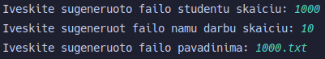

# Tyrimai

### Matavimo sistemos parametrai:
  > __CPU__: 7800x3d \
  > __RAM__: 32GB | 6000 MT/s \
  > __SSD__: NVMe M.2 | 7,000/7,000MB/s read/write

## Pirmas tyrimas (Failų kūrimas ir jų uždarymas)
* Kiekvienas studentas turi po 10 namų darbų rezultatų + egzaminas
* Laiko matavimui naudoajam `chrono` biblioteka
* Matavimai atliekami penkis kartus ir iš jų išgaunami vidurkiai
* Kodas buvo sukompiliuotas naudojant -O3 gaire

| Studentu sk. | Laikas 1 | Laikas 2 | Laikas 3 | Laikas 4 | Laikas 5 | Vidurkiai |
|--------------|----------|----------|----------|----------|----------|-----------|
| 1,000        | 866 μs   | 966 μs   | 877 μs   | 792 μs   | 936 μs   | 887 μs    |
| 10,000       | 6486 μs  | 6903 μs  | 6497 μs  | 6364 μs  | 6307 μs  | 6511 μs   |
| 100,000      | 68 ms    | 66 ms    | 65 ms    | 66 ms    | 67 ms    | 66 ms     |
| 1,000,000    | 594 ms   | 592 ms   | 587 ms   | 595 ms   | 608 ms   | 595 ms    |
| 10,000,000   | 5917 ms  | 5827 ms  | 5871 ms  | 5843 ms  | 5887 ms  | 5869 ms   |

>Failo kūrimo pavizdys:   

## Antrasis tyrimas (Duomenų apdorojimas)
* Laiko matavimui naudoajam `chrono` biblioteka
* Duomenys gaunaumi iš ankščiau sugeneruotų failų
* Kiekvienas studentas turi po 10 namų darbų rezultatų + egzaminas
* Matavimai atliekami penkis kartus ir iš jų išgaunami vidurkiai
* Matuojami vykdomi su penkiais skirtingais matavimo dydžiais
* Kodas buvo sukompiliuotas naudojant -O3 gaire
* Matuojami:
  * nuskaitymas iš failo
  * studentų rūšiavimą į dvi grupes/kategorijas
  * surūšiuotų studentų išvedimą į du naujus failus
  * visos programos veikimo laikas

### 1,000 studentų

| Matavimas      | Laikas 1 | Laikas 2 | Laikas 3 | Laikas 4 | Laikas 5 | Vidurkiai |
|----------------|----------|----------|----------|----------|----------|-----------|
| Nuskaitymas    | 545 μs   | 639 μs   | 518 μs   | 509 μs   | 485 μs   | 539 μs    |
| Rūšiavimas     | 101 μs   | 134 μs   | 100 μs   | 101 μs   | 101 μs   | 107 μs    |
| Išvedimas      | 340 μs   | 435 μs   | 394 μs   | 362 μs   | 369 μs   | 380 μs    |
| Veikimo laikas | 1092 μs  | 1334 μs  | 1113 μs  | 1076 μs  | 1056 μs  | 1134 μs   |

### 10,000 studentų

| Matavimas      | Laikas 1 | Laikas 2 | Laikas 3 | Laikas 4 | Laikas 5 | Vidurkiai |
|----------------|----------|----------|----------|----------|----------|-----------|
| Nuskaitymas    | 5524 μs  | 5118 μs  | 5430 μs  | 5809 μs  | 5024 μs  | 5381 μs   |
| Rūšiavimas     | 1043 μs  | 1129 μs  | 1133 μs  | 1107 μs  | 1106 μs  | 1104 μs   |
| Išvedimas      | 2795 μs  | 2835 μs  | 2870 μs  | 2859 μs  | 2770 μs  | 2826 μs   |
| Veikimo laikas | 10321 μs | 10053 μs | 10386 μs | 10760 μs | 9873 μs  | 10279 μs  |

### 100,000 studentų

| Matavimas      | Laikas 1 | Laikas 2 | Laikas 3 | Laikas 4 | Laikas 5 | Vidurkiai |
|----------------|----------|----------|----------|----------|----------|-----------|
| Nuskaitymas    | 47 ms    | 48 ms    | 46 ms    | 49 ms    | 47 ms    | 47 ms     |
| Rūšiavimas     | 7 ms     | 7 ms     | 6 ms     | 6 ms     | 6 ms     | 6 ms      |
| Išvedimas      | 27 ms    | 27 ms    | 25 ms    | 32 ms    | 33 ms    | 29 ms     |
| Veikimo laikas | 90 ms    | 92 ms    | 88 ms    | 98 ms    | 97 ms    | 93 ms     |

### 1,000,000 studentų

| Matavimas      | Laikas 1 | Laikas 2 | Laikas 3 | Laikas 4 | Laikas 5 | Vidurkiai |
|----------------|----------|----------|----------|----------|----------|-----------|
| Nuskaitymas    | 440 ms   | 443 ms   | 443 ms   | 444 ms   | 444 ms   | 443 ms    |
| Rūšiavimas     | 51 ms    | 51 ms    | 53 ms    | 50 ms    | 52 ms    | 51 ms     |
| Išvedimas      | 270 ms   | 273 ms   | 275 ms   | 267 ms   | 268 ms   | 270 ms    |
| Veikimo laikas | 848 ms   | 855 ms   | 859 ms   | 849 ms   | 853 ms   | 853 ms    |

### 10,000,000 studentų

| Matavimas      | Laikas 1 | Laikas 2 | Laikas 3 | Laikas 4 | Laikas 5 | Vidurkiai |
|----------------|----------|----------|----------|----------|----------|-----------|
| Nuskaitymas    | 4476 ms  | 4483 ms  | 4502 ms  | 4465 ms  | 4491 ms  | 4483 ms   |
| Rūšiavimas     | 668 ms   | 677 ms   | 685 ms   | 670 ms   | 679 ms   | 676 ms    |
| Išvedimas      | 2602 ms  | 2628 ms  | 2586 ms  | 2640 ms  | 2665 ms  | 2624 ms   |
| Veikimo laikas | 8686 ms  | 8750 ms  | 8730 ms  | 8727 ms  | 8781 ms  | 8735 ms   |

## Trečiasis tyrimas (Konteinerių testavimas)

* Laiko matavimui naudoajam `chrono` biblioteka
* Duomenys gaunaumi iš ankščiau sugeneruotų failų
* Kiekvienas studentas turi po 10 namų darbų rezultatų + egzaminas
* Matavimai atliekami penkis kartus ir iš jų išgaunami vidurkiai
* Matuojami vykdomi su penkiais skirtingais matavimo dydžiais
* Kodas buvo sukompiliuotas naudojant -O3 gaire
* Duomenys rūšiuojami studento pažymių vidurkio didėjimo tvarka
* Matuojas:
  * Duomenų nuskaitymas iš failų į atitinkamą konteinerį
  * Studentų rūšiavimas didėjimo tvarką konteineryje
  * Studentų skirstymas į dvi grupes/kategorijas
* Studentams saugoti bus naudojami 3 skirtingi konteineriai:
  * `std::vector`
  * `std::list`
  * `std::deque`

## Naudojant `std::vector`

### 1,000 studentų

| Matavimas   | Laikas 1 | Laikas 2 | Laikas 3 | Laikas 4 | Laikas 5 | Vidurkiai |
|-------------|----------|----------|----------|----------|----------|-----------|
| Nuskaitymas | 504 μs   | 573 μs   | 582 μs   | 609 μs   | 495 μs   | 552 μs    |
| Rušiavimas  | 53 μs    | 65 μs    | 67 μs    | 64 μs    | 52 μs    | 60 μs     |
| Skirstymas  | 98 μs    | 119 μs   | 112 μs   | 122 μs   | 99 μs    | 110 μs    |

### 10,000 studentų

| Matavimas   | Laikas 1 | Laikas 2 | Laikas 3 | Laikas 4 | Laikas 5 | Vidurkiai |
|-------------|----------|----------|----------|----------|----------|-----------|
| Nuskaitymas | 5396 μs  | 5124 μs  | 5232 μs  | 4846 μs  | 5028 μs  | 5125 μs   |
| Rušiavimas  | 826 μs   | 745 μs   | 785 μs   | 939 μs   | 943 μs   | 847 μs    |
| Skirstymas  | 955 μs   | 941 μs   | 965 μs   | 997 μs   | 1099 μs  | 991 μs    |

### 100,000 studentų

| Matavimas   | Laikas 1 | Laikas 2 | Laikas 3 | Laikas 4 | Laikas 5 | Vidurkiai |
|-------------|----------|----------|----------|----------|----------|-----------|
| Nuskaitymas | 49040 μs | 46073 μs | 48257 μs | 49288 μs | 50360 μs | 48603 μs  |
| Rušiavimas  | 11722 μs | 12060 μs | 11927 μs | 12071 μs | 12136 μs | 11983 μs  |
| Skirstymas  | 9479 μs  | 9184 μs  | 8919 μs  | 9446 μs  | 9274 μs  | 9260 μs   |

### 1,000,000 studentų

| Matavimas   | Laikas 1 | Laikas 2 | Laikas 3 | Laikas 4 | Laikas 5 | Vidurkiai |
|-------------|----------|----------|----------|----------|----------|-----------|
| Nuskaitymas | 430 ms   | 435 ms   | 437 ms   | 443 ms   | 436 ms   | 436 ms    |
| Rušiavimas  | 134 ms   | 140 ms   | 145 ms   | 141 ms   | 136 ms   | 139 ms    |
| Skirstymas  | 111 ms   | 109 ms   | 110 ms   | 110 ms   | 109 ms   | 109 ms    |

### 10,000,000 studentų

| Matavimas   | Laikas 1 | Laikas 2 | Laikas 3 | Laikas 4 | Laikas 5 | Vidurkiai |
|-------------|----------|----------|----------|----------|----------|-----------|
| Nuskaitymas | 4414 ms  | 4401 ms  | 4396 ms  | 4444 ms  | 4414 ms  | 4413 ms   |
| Rušiavimas  | 1743 ms  | 1665 ms  | 1729 ms  | 1722 ms  | 1660 ms  | 1703 ms   |
| Skirstymas  | 1350 ms  | 1357 ms  | 1348 ms  | 1343 ms  | 1350 ms  | 1349 ms   |

## Naudojant `std::list`

### 1,000 studentų

| Matavimas   | Laikas 1 | Laikas 2 | Laikas 3 | Laikas 4 | Laikas 5 | Vidurkiai |
|-------------|----------|----------|----------|----------|----------|-----------|
| Nuskaitymas | 560 μs   | 576 μs   | 606 μs   | 485 μs   | 594 μs   | 564 μs    |
| Rušiavimas  | 52 μs    | 64 μs    | 66 μs    | 52 μs    | 65 μs    | 59 μs     |
| Skirstymas  | 99 μs    | 121 μs   | 119 μs   | 94 μs    | 126 μs   | 111 μs    |

### 10,000 studentų

| Matavimas   | Laikas 1 | Laikas 2 | Laikas 3 | Laikas 4 | Laikas 5 | Vidurkiai |
|-------------|----------|----------|----------|----------|----------|-----------|
| Nuskaitymas | 4843 μs  | 5330 μs  | 4923 μs  | 4755 μs  | 5391 μs  | 5048 μs   |
| Rušiavimas  | 761 μs   | 738 μs   | 756 μs   | 757 μs   | 735 μs   | 749 μs    |
| Skirstymas  | 1005 μs  | 1068 μs  | 894 μs   | 882 μs   | 963 μs   | 962 μs    |

### 100,000 studentų

| Matavimas   | Laikas 1 | Laikas 2 | Laikas 3 | Laikas 4 | Laikas 5 | Vidurkiai |
|-------------|----------|----------|----------|----------|----------|-----------|
| Nuskaitymas | 47977 μs | 47000 μs | 48757 μs | 49032 μs | 59094 μs | 50372 μs  |
| Rušiavimas  | 12449 μs | 12087 μs | 12294 μs | 12273 μs | 12074 μs | 12235 μs  |
| Skirstymas  | 9721 μs  | 9184 μs  | 10342 μs | 9746 μs  | 9834 μs  | 9765 μs   |

### 1,000,000 studentų

| Matavimas   | Laikas 1 | Laikas 2 | Laikas 3 | Laikas 4 | Laikas 5 | Vidurkiai |
|-------------|----------|----------|----------|----------|----------|-----------|
| Nuskaitymas | 476 ms   | 472 ms   | 477 ms   | 477 ms   | 473 ms   | 475 ms    |
| Rušiavimas  | 285 ms   | 233 ms   | 256 ms   | 243 ms   | 233 ms   | 250 ms    |
| Skirstymas  | 167 ms   | 155 ms   | 168 ms   | 165 ms   | 162 ms   | 163 ms    |

### 10,000,000 studentų

| Matavimas   | Laikas 1 | Laikas 2 | Laikas 3 | Laikas 4 | Laikas 5 | Vidurkiai |
|-------------|----------|----------|----------|----------|----------|-----------|
| Nuskaitymas | 4643 ms  | 4681 ms  | 4723 ms  | 4707 ms  | 4613 ms  | 4673 ms   |
| Rušiavimas  | 5225 ms  | 5597 ms  | 5502 ms  | 5185 ms  | 5349 ms  | 5371 ms   |
| Skirstymas  | 1647 ms  | 1710 ms  | 1669 ms  | 1654 ms  | 1658 ms  | 1667 ms   |

## Naudojant `std::deque`

### 1,000 studentų

| Matavimas   | Laikas 1 | Laikas 2 | Laikas 3 | Laikas 4 | Laikas 5 | Vidurkiai |
|-------------|----------|----------|----------|----------|----------|-----------|
| Nuskaitymas | 589 μs   | 511 μs   | 480 μs   | 565 μs   | 593 μs   | 547 μs    |
| Rušiavimas  | 133 μs   | 108 μs   | 100 μs   | 124 μs   | 126 μs   | 118 μs    |
| Skirstymas  | 102 μs   | 84 μs    | 81 μs    | 99 μs    | 91 μs    | 91 μs     |

### 10,000 studentų

| Matavimas   | Laikas 1 | Laikas 2 | Laikas 3 | Laikas 4 | Laikas 5 | Vidurkiai |
|-------------|----------|----------|----------|----------|----------|-----------|
| Nuskaitymas | 4974 μs  | 4865 μs  | 4524 μs  | 4909 μs  | 4793 μs  | 4813 μs   |
| Rušiavimas  | 1103 μs  | 1213 μs  | 1129 μs  | 1070 μs  | 1106 μs  | 1124 μs   |
| Skirstymas  | 891 μs   | 814 μs   | 760 μs   | 852 μs   | 768 μs   | 817 μs    |

### 100,000 studentų

| Matavimas   | Laikas 1 | Laikas 2 | Laikas 3 | Laikas 4 | Laikas 5 | Vidurkiai |
|-------------|----------|----------|----------|----------|----------|-----------|
| Nuskaitymas | 45226 μs | 45315 μs | 57134 μs | 46732 μs | 45353 μs | 47952 μs  |
| Rušiavimas  | 13310 μs | 13076 μs | 13947 μs | 12625 μs | 12929 μs | 13177 μs  |
| Skirstymas  | 8509 μs  | 8437 μs  | 8048 μs  | 8168 μs  | 8224 μs  | 8277 μs   |

### 1,000,000 studentų

| Matavimas   | Laikas 1 | Laikas 2 | Laikas 3 | Laikas 4 | Laikas 5 | Vidurkiai |
|-------------|----------|----------|----------|----------|----------|-----------|
| Nuskaitymas | 453 ms   | 461 ms   | 458 ms   | 452 ms   | 453 ms   | 455 ms    |
| Rušiavimas  | 159 ms   | 166 ms   | 155 ms   | 164 ms   | 164 ms   | 161 ms    |
| Skirstymas  | 128 ms   | 132 ms   | 140 ms   | 136 ms   | 127 ms   | 132 ms    |

### 10,000,000 studentų

| Matavimas   | Laikas 1 | Laikas 2 | Laikas 3 | Laikas 4 | Laikas 5 | Vidurkiai |
|-------------|----------|----------|----------|----------|----------|-----------|
| Nuskaitymas | 4520 ms  | 4489 ms  | 4540 ms  | 4530 ms  | 5122 ms  | 4640 ms   |
| Rušiavimas  | 2040 ms  | 1952 ms  | 1952 ms  | 1982 ms  | 1969 ms  | 1979 ms   |
| Skirstymas  | 1496 ms  | 1479 ms  | 1503 ms  | 1482 ms  | 1500 ms  | 1492 ms   |

## Ketvirtas tyrimas (Skirstymas)

* Testai vyks su 10,000,000 studentu failu
* Duomenys nerūšiuojami
* Naudojamos 3 strategijos:
  1. Bendro studentai konteinerio skaidymas (rūšiavimas) į du naujus to paties tipo konteinerius
  2. Bendro studentų konteinerio skaidymas (rūšiavimas) panaudojant tik vieną naują konteinerį
  3. Bendro studentų konteinerio skaidymas (rūšiavimas) panaudojant "efektyvius" darbo su konteineriais metodus (``erase``, ``remove_if``)

### vector

| Matavimas    | Laikas 1 | Laikas 2 | Laikas 3 | Laikas 4 | Laikas 5 | Vidurkiai |
|--------------|----------|----------|----------|----------|----------|-----------|
| 1 strategija | 688 ms   | 683 ms   | 697 ms   | 687 ms   | 682 ms   | 687 ms    |
| 2 strategija | 539 ms   | 548 ms   | 547 ms   | 541 ms   | 542 ms   | 543 ms    |
| 3 strategija | 351 ms   | 356 ms   | 360 ms   | 352 ms   | 353 ms   | 354 ms    |

### list

| Matavimas    | Laikas 1 | Laikas 2 | Laikas 3 | Laikas 4 | Laikas 5 | Vidurkiai |
|--------------|----------|----------|----------|----------|----------|-----------|
| 1 strategija | 912 ms   | 916 ms   | 933 ms   | 915 ms   | 929 ms   | 921 ms    |
| 2 strategija | 175 ms   | 170 ms   | 179 ms   | 173 ms   | 175 ms   | 174 ms    |
| 3 strategija | 671 ms   | 664 ms   | 661 ms   | 661 ms   | 688 ms   | 669 ms    |

### deque

| Matavimas    | Laikas 1 | Laikas 2 | Laikas 3 | Laikas 4 | Laikas 5 | Vidurkiai |
|--------------|----------|----------|----------|----------|----------|-----------|
| 1 strategija | 822 ms   | 829 ms   | 833 ms   | 834 ms   | 821 ms   | 827 ms    |
| 2 strategija | 245 ms   | 240 ms   | 241 ms   | 236 ms   | 240 ms   | 240 ms    |
| 3 strategija | 461 ms   | 459 ms   | 452 ms   | 459 ms   | 466 ms   | 459 ms    |

