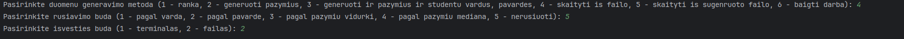
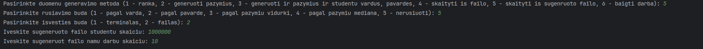

# Tyrimai

## Pirmas tyrimas (Failų kūrimas ir jų uždarymas) 
* Failai kuriami iš apskaičiuotų studentų masyvų.
* Sukuriami du failai nuskriaustukai.txt galvociai.txt.
* Į failus rašomi duomenys yra dviejuose sugeneruotuose vectoriuose.
* Duomenys sugeneruojami ir gaunami iš kursiokai.txt. 
* Kursiokai.txt turi 1,000,000 studentų
* Kiekvienas studentas turi po 10 namų darbų rezultatų + egzaminas
* Laiko matavimui naudoajam `chrono` biblioteka
* Matavimai atliekami penkis kartus ir iš jų išgaunami vidurkiai
* Matuojami abiejų teksto failo generavimo laikai atskirai (Abudu failai nėra generuojami tuo pačiu laiku)
* Matavimuose įskaičiuojami failo sukurimo, duomenų įvedimo ir uždarymo laikai

| Failas              | Laikas 1 | Laikas 2 | Laikas 3 | Laikas 4 | Laikas 5 | Vidurkiai |
|---------------------|----------|----------|----------|----------|----------|-----------|
| nuskriaustukai.txt  | 138 ms   | 142 ms   | 136 ms   | 129 ms   | 136 ms   | 136 ms    |
| galvociai.txt       | 137 ms   | 137 ms   | 127 ms   | 129 ms   | 138 ms   | 134 ms    |

## Antrasis tyrimas (Duomenų apdorojimas)
* Laiko matavimui naudoajam `chrono` biblioteka
* Duomenys sugeneruojami ir gaunami iš kursiokai.txt.
* Kursiokai.txt turi 1,000,000 studentų
* Kiekvienas studentas turi po 10 namų darbų rezultatų + egzaminas
* Matavimai atliekami penkis kartus ir iš jų išgaunami vidurkiai
* Kiekvienas matavimas vyko nuosekliai vienas po kito
* Matuojami:
  * nuskaitymas iš failo
  * studentų rūšiavimą į dvi grupes/kategorijas
  * surūšiuotų studentų išvedimą į du naujus failus
  * visos programos veikimo laikas

| Matavimas      | Laikas 1 | Laikas 2 | Laikas 3  | Laikas 4 | Laikas 5 | Vidurkiai |
|----------------|----------|----------|-----------|----------|----------|-----------|
| Nuskaitymas    | 440 ms   | 443 ms   | 443 ms    | 444 ms   | 444 ms   | 443 ms    |
| Rūšiavimas     | 51 ms    | 51 ms    | 53 ms     | 50 ms    | 52 ms    | 51 ms     |
| Išvedimas      | 270 ms   | 273 ms   | 275 ms    | 267 ms   | 268 ms   | 270 ms    |
| Veikimo laikas | 848 ms   | 855 ms   | 859 ms    | 849 ms   | 853 ms   | 853 ms    |

> Parinktys:

> Failo generavimo parinktys:
